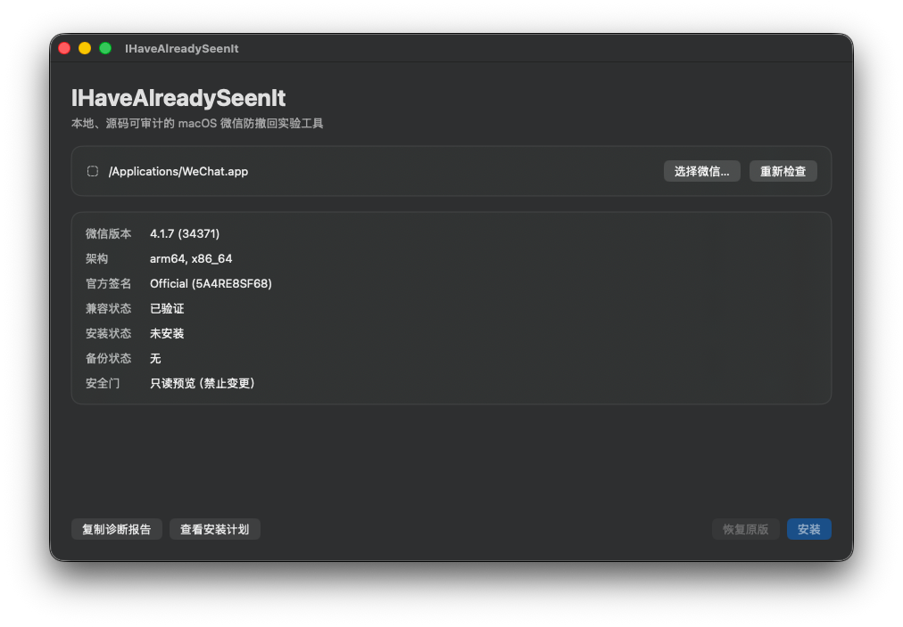

# IHaveAlreadySeenIt

IHaveAlreadySeenIt 是一个本地、源码可审计的 macOS 微信防撤回实验工具。它不是微信官方插件，而是一个严格锁定版本的本地补丁管理器。它结合了两类思路：

- 使用版本、build、SHA-256 和机器码特征进行严格匹配，并提供完整备份与恢复。
- 在 macOS 上从源码编译一个极小动态库，通过 `LC_LOAD_DYLIB` 加载后在内存中关闭撤回判断。

当前规则仅允许本机已检查的微信 `4.1.7 (34371)`，可执行文件 SHA-256：

```text
764966cdaaf945bc8b23968bb7b3dca3cdc4067e2891a38e28c7556788e0682c
```

其他版本、build 或哈希会默认拒绝安装。不要为了绕过检查而随意添加未知哈希。

## 隐私边界

IHaveAlreadySeenIt：

- 不访问网络，也没有遥测或自动更新。
- 不安装 LaunchAgent，不常驻后台。
- 不使用 LLDB，不附加微信进程。
- 不读取聊天数据库、消息正文、联系人或登录账号。
- 不包含预编译注入器；hook 在安装时由本机 `clang` 从源码编译。
- 日志只写 hook 是否成功到 `/tmp/ihavealreadyseenit-hook.log`。

## 仍然存在的风险

安装会修改 `/Applications/WeChat.app` 的主程序、加入动态库并进行 ad-hoc 重签名。这会破坏腾讯原始代码签名，可能触发 macOS、微信更新器、企业安全软件或账号风控。微信更新后补丁通常会失效。

当前 hook 把匹配到的撤回判断固定为 false，因此“自己撤回”在本机的显示也可能与官方客户端不同。服务端行为不由本工具控制。

本项目不会自动修改真实微信。请先运行只读检查和预演，并自行决定是否接受风险。

## 支持状态

| 微信版本 | Build | 架构 | 状态 |
|---|---:|---|---|
| 4.1.7 | 34371 | arm64 + x86_64 | 已验证 |

其他版本、Build、哈希或架构会安全拒绝，不会尝试模糊匹配。

## 构建

需要 macOS 14 或更高版本，以及 Xcode Command Line Tools：

```bash
xcode-select --install
make test
make build
scripts/package-app.sh
```

CLI 位于 `.build/release/ihavealreadyseenit`。未配置 Developer ID 时，`scripts/package-app.sh` 会在 `dist/` 中生成只能检查和预演的未签名 GUI；高权限安装与恢复被刻意禁用。

正式发行需要 Developer ID Application 证书与 Apple 公证。证书和公证凭据只能放在本机钥匙串或 GitHub Encrypted Secrets 中。

## 图形界面



GUI 默认检查 `/Applications/WeChat.app`，也可以选择其他 App。首页显示版本、架构、官方签名、兼容状态、安装状态和备份状态，并提供：

- 只读检查和重新检查。
- 不写文件的完整安装预演。
- 可复制的隐私安全诊断报告。
- 签名发行版中的安装和恢复操作。

未签名开发者预览版会明确显示“只读预览（禁止变更）”，且安装、恢复入口均不可用。未来的签名发行版还必须同时验证 App 与内嵌 Helper 的 Developer ID Team ID 一致，才会开放变更操作；安装前仍需再次确认风险。

## 使用

只读检查：

```bash
.build/release/ihavealreadyseenit inspect
```

完整预演，包括在内存中验证 Mach-O 注入，不写文件：

```bash
.build/release/ihavealreadyseenit plan
```

隐私安全诊断：

```bash
.build/release/ihavealreadyseenit doctor
.build/release/ihavealreadyseenit doctor --json
```

安装前请退出微信。确认接受风险后：

```bash
sudo .build/release/ihavealreadyseenit install --confirm-i-understand
```

安装器会先把完整原始应用备份到 `/Applications/.IHaveAlreadySeenItBackup/Original-WeChat.bundle`。任一步骤失败都会尝试自动恢复。

卸载并恢复腾讯原始签名版本：

```bash
sudo .build/release/ihavealreadyseenit uninstall
```

## 安全门

安装必须同时满足：

1. Bundle ID 为 `com.tencent.xinWeChat`。
2. 版本、build 和 SHA-256 命中本地允许规则。
3. 主程序同时包含 arm64 与 x86_64。
4. 两种架构的撤回函数特征码分别且仅命中一次。
5. Mach-O 头部有足够的零填充空间，不覆盖任何 section。
6. 原应用通过严格代码签名验证，Team ID 为 `5A4RE8SF68`。
7. 路径不是符号链接，所有者可信，父目录可写且磁盘空间充足。
8. 微信进程已退出。
9. 备份再次通过官方签名验证。
10. 安装后 load command 与 ad-hoc 代码签名验证通过。

## 项目结构

```text
Sources/IHaveAlreadySeenItCore/             分析、诊断、安装事务与资源
Sources/ihavealreadyseenit/                 CLI
Sources/IHaveAlreadySeenItApp/              SwiftUI GUI
Sources/IHaveAlreadySeenItPrivilegedHelper/ 签名发行版的最小权限 Helper
Tests/IHaveAlreadySeenItCoreTests/          无真实应用写入的测试
```

## Homebrew

签名并公证的 Release 会同时生成带固定 SHA-256 的 Cask。Cask 应发布到 `FujimiyaKaor1/homebrew-tap` 后再提供安装命令；仓库中的模板不会使用 `:no_check` 绕过校验。

维护者发布流程与所需 Secrets 见 [RELEASING.md](RELEASING.md)。

## 获取帮助

提交 Issue 前请阅读 [FAQ](FAQ.md)，并附上 `doctor --json` 的输出。不要上传聊天数据库、消息、账号信息、微信可执行文件或备份。

## 致谢与许可

设计参考了 `a244573118/WeChatIntercept` 的 macOS 动态注入思路，以及 `huiyadanli/RevokeMsgPatcher` 的版本规则、备份恢复和失败即停思路。本项目没有复用两者仓库中的预编译二进制。

项目以 GPL-3.0 许可发布，仅用于本地研究与测试。使用者需自行遵守适用法律、软件许可和平台规则。
