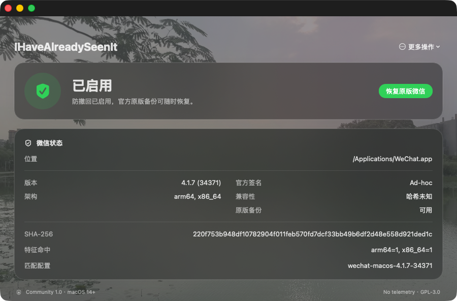

# IHaveAlreadySeenIt

IHaveAlreadySeenIt 是一个免费、开源、仅在本机运行的 macOS 微信防撤回工具。它提供面向普通用户的图形界面，在修改微信前检查官方签名和精确版本，自动保存完整原版备份，并在失败时回滚。

项目不读取聊天内容、联系人或账号信息，不包含遥测、自动上传和后台自动修改。它不是微信官方插件；修改客户端仍可能带来兼容性、更新或账号风险，请在理解风险后使用。



## 适合谁使用

- 使用 macOS 14 或更高版本。
- 安装了下方支持矩阵中的官方微信版本。
- 接受 Community Build 未经 Apple 公证、首次需要右键打开。
- 希望随时通过 GUI 恢复完整官方原版微信。

不在支持矩阵中的版本只会显示诊断信息，工具不会尝试注入或模糊匹配。

## 下载与安装

### Homebrew（推荐）

Homebrew 会自动下载 GitHub Release、核对 SHA-256 并把 App 安装到 Applications：

```bash
brew tap FujimiyaKaor1/ihavealreadyseenit https://github.com/FujimiyaKaor1/IHaveAlreadySeenIt.git
brew install --cask FujimiyaKaor1/ihavealreadyseenit/ihavealreadyseenit
```

项目仓库本身同时也是 Homebrew Tap，因此不需要维护第二个仓库。第一条命令中的显式 URL
用于告诉 Homebrew 从本仓库读取根目录下的 `Casks/`；使用完整 Cask 名称可以避免名称歧义。

安装完成后，首次启动仍需在 Finder 的“应用程序”中右键 IHaveAlreadySeenIt，选择“打开”并确认。Homebrew 不会绕过 Gatekeeper，也不会代替 GUI 获取管理员权限。

更新工具：

```bash
brew update
brew upgrade --cask ihavealreadyseenit
```

升级只替换管理工具，不会修改微信或删除原版备份。升级后请打开 GUI 重新检测。

卸载前必须先恢复原版微信：请在 GUI 中选择“恢复原版微信”，确认完成后再执行：

```bash
brew uninstall --cask ihavealreadyseenit
```

Homebrew 只移除 IHaveAlreadySeenIt，不会自动恢复已经修改的微信。

### 手动下载 DMG

也可以从本仓库的 [GitHub Releases](https://github.com/FujimiyaKaor1/IHaveAlreadySeenIt/releases/latest) 下载：

- `IHaveAlreadySeenIt-<版本>-Community.dmg`：图形界面安装包。
- `IHaveAlreadySeenIt-<版本>-Community.dmg.sha256`：安装包校验和。
- Source code：供审计和自行构建的源码。

项目不通过 App Store 或第三方网盘分发。Homebrew Cask 只允许从本项目的 GitHub Release 下载带固定 SHA-256 的 DMG。不要运行来源不明的重新打包版本，也不要执行 `curl | sh`、关闭 Gatekeeper/SIP 或使用 `xattr` 绕过系统保护。

可在终端核对下载文件：

```bash
cd ~/Downloads
shasum -a 256 -c IHaveAlreadySeenIt-*-Community.dmg.sha256
```

输出 `OK` 后再打开 DMG。

## 安装与部署

1. 打开下载的 DMG，将 `IHaveAlreadySeenIt.app` 拖入 `Applications`。
2. 第一次启动时，在 Finder 的“应用程序”中右键该 App，选择“打开”，再确认一次。
3. 正常退出微信；工具只会等待微信退出，不会强制结束进程。
4. 打开 IHaveAlreadySeenIt，确认页面显示的微信路径、版本、官方签名和兼容状态。
5. 点击首页主按钮，阅读备份、签名变化和账号风险说明后再确认。
6. 如果 `/Applications` 需要管理员权限，GUI 会显示一条固定命令。选择“复制命令并打开终端”，检查命令后在终端输入 macOS 密码。
7. 安装成功后点击“启动微信”。需要撤销时重新打开工具，选择“恢复原版微信”。

GUI 不会索取或保存管理员密码。终端命令只能调用当前 App 内嵌的 CLI 执行安装或恢复，路径会经过标准化和严格转义。

## 支持状态

| 微信版本 | Build | 架构 | 官方主程序 SHA-256 | 状态 |
|---|---:|---|---|---|
| 4.1.7 | 34371 | arm64 + x86_64 | `764966cdaaf945bc8b23968bb7b3dca3cdc4067e2891a38e28c7556788e0682c` | 已验证 |

每个受支持版本都必须精确匹配 Bundle ID、腾讯 Team ID `5A4RE8SF68`、版本、Build、整包与双架构 SHA-256，并保证 arm64、x86_64 特征各命中一次且有足够的 Mach-O 头部空间。候选版本只能诊断，不能安装。

微信更新后，请重新打开本工具检测。旧规则不会自动接受新 Build；在新版本完成真实安装与恢复验证前，拒绝修改属于正常安全行为。

当前版本的验证记录：[WeChat macOS 4.1.7 (34371)](Documentation/compatibility/wechat-macos-4.1.7-34371.md)。

## 如何反馈

### 遇到功能问题

1. 在 GUI 的“更多操作”中选择“复制诊断报告”。
2. 记录可以稳定复现问题的操作步骤、预期结果和实际结果。
3. 使用 [Bug Report 模板](https://github.com/FujimiyaKaor1/IHaveAlreadySeenIt/issues/new?template=bug_report.yml) 提交。

### 申请适配新的微信版本

1. 打开 GUI 检测当前微信；未知版本不会被修改。
2. 复制安全诊断报告，记录版本、Build、架构、Team ID、SHA-256 和特征命中数。
3. 使用 [Version Support 模板](https://github.com/FujimiyaKaor1/IHaveAlreadySeenIt/issues/new?template=version_support.yml) 提交。

反馈时严禁上传以下内容：

- `WeChat.app`、微信主程序或任何微信二进制。
- `.IHaveAlreadySeenItBackup`、其他备份或 hook 日志。
- 聊天数据库、消息正文、联系人、账号标识或登录信息。
- 证书、私钥、密码或其他凭据。

诊断报告只用于判断版本需求，不会让未知版本自动进入安装白名单。常见问题见 [FAQ](FAQ.md)。

## 隐私、安全与恢复

- 无遥测、无自动上传、无自动更新、无后台常驻项。
- 不读取聊天数据库，不附加正在运行的微信进程。
- 修改前保存完整官方 App，并记录恢复所需状态。
- 安装事务包含备份、暂存、注入、签名、验证、替换和状态写入；任一阶段失败都会尝试恢复原版。
- 修改后的微信采用 ad-hoc 签名，不再保有腾讯原始签名；恢复后会重新验证官方签名和原始 SHA-256。
- Community 安装包不包含、不安装、不注册 Privileged Helper。

## 从源码部署

开发者需要 macOS 14+、Xcode Command Line Tools 和本仓库源码：

```bash
git clone https://github.com/FujimiyaKaor1/IHaveAlreadySeenIt.git
cd IHaveAlreadySeenIt
make test
make install-local
```

`make install-local` 只使用本地源码构建、ad-hoc 签名并安装 GUI，不联网下载脚本，也不会自行获取管理员权限。维护者还可以运行：

```bash
make coverage
make dmg
make verify-version APP="/path/to/WeChat.app"
```

贡献新版本规则前请阅读 [CONTRIBUTING.md](CONTRIBUTING.md)；发布流程见 [RELEASING.md](RELEASING.md)。界面素材与授权记录见 [Assets/README.md](Assets/README.md)。

## 许可证

本项目采用 [GPL-3.0](LICENSE) 许可证，仅用于本地研究和个人选择。使用者需自行遵守适用法律、软件许可和平台规则。
